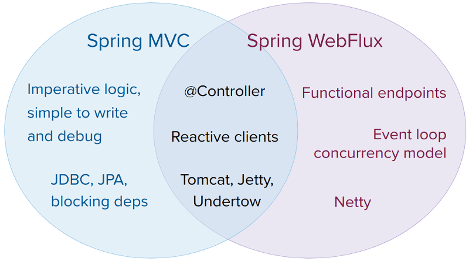

# webflux

## HandlerFunction
HandlerFunction相当于Controller中的具体处理方法，输入为请求，输出为装在Mono中的响应。

## RouterFunction
相当于@RequestMapping，用来判断什么样的url映射到那个具体的HandlerFunction，输入为请求，输出为装在Mono里边的Handlerfunction。

在WebFlux中，请求和响应不再是WebMVC中的ServletRequest和ServletResponse，而是ServerRequest和ServerResponse。